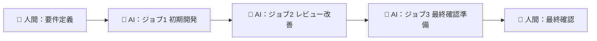

# AGENTS.md

## AI共同開発ワークフロー（あきらパパ式）

このプロジェクトでは「人間は最初と最後だけ、開発作業は全てAIが実行」する開発スタイルを採用しています。

### ワークフローの概要



## Project Structure

```
ride-on-ai-0921-1/
├── src/                    # ソースコード
│   ├── app/               # Next.js App Router
│   └── components/        # 再利用可能なコンポーネント
├── docs/                  # ドキュメント
│   ├── specs/            # 仕様書（AIが作成）
│   ├── tasks/            # タスクリスト（AIが管理）
│   ├── reviews/          # コードレビュー記録
│   └── guides/           # 解説ガイド
├── prompts/              # AIプレイブックテンプレート
├── tasks/                # タスク定義MD
└── tests/                # テストコード
    ├── unit/             # Jestユニットテスト
    └── e2e/              # Playwrightエンドツーエンドテスト
```

## Setup Commands

```bash
# 依存関係のインストール
pnpm install

# 開発サーバーの起動
pnpm dev

# ビルド（Next.js）
pnpm build

# テスト実行
pnpm test         # Jest単体テスト
pnpm test:e2e     # Playwright E2Eテスト

# リント・フォーマット
pnpm lint         # ESLint実行
pnpm format       # Prettier実行
```

## 開発ワークフロー詳細

### ジョブ0：準備フェーズ
- 人間が体系的な依頼プロンプトを書く
- `prompts/tasks_authoring.md`を使って要件をタスク化

### ジョブ1：初期開発フェーズ
1. **仕様書作成**
   - `docs/specs/`に詳細仕様を記述
   - API仕様、データモデル、エラー定義を含む

2. **タスクリスト作成**
   - `tasks/`にタスク定義MDを作成
   - DoD（Definition of Done）を明確化

3. **実装**
   - `prompts/implement_from_task_md.md`に従って実装
   - TypeScript strict mode使用
   - 関数型パターンを優先

4. **テスト作成**
   - `prompts/jest_from_impl.md`でユニットテスト作成
   - `prompts/playwright_from_impl.md`でE2Eテスト作成

5. **ドキュメント更新**
   - `prompts/specs_sync.md`で仕様書を同期

### ジョブ2：レビュー＆改善フェーズ
1. **コードレビュー**
   - `prompts/code_review_playbook.md`に従ってレビュー
   - `docs/reviews/`にレビュー結果を記録

2. **修正**
   - レビュー指摘事項を反映
   - `prompts/test_fix_loop.md`でテスト修正

3. **解説ガイド作成**
   - `docs/guides/`に実装の解説を記述
   - 設計判断の理由を文書化

4. **ドキュメント更新**
   - 最終的な実装に合わせて全ドキュメントを同期

### ジョブ3：最終確認フェーズ
1. **AIが最終動作確認チェックリスト作成**
   - 主要機能の動作確認項目
   - エッジケースの検証項目
   - パフォーマンス確認項目

2. **人間がチェックリスト通りに動作確認**
   - AIが作成したチェックリストを実行
   - 問題があれば修正依頼

## Code Style Guidelines

### TypeScript
- **Strict Mode**: 必須
- **型定義**: 明示的に型を定義、anyは使用禁止
- **命名規則**:
  - コンポーネント: PascalCase
  - 関数・変数: camelCase
  - 定数: UPPER_SNAKE_CASE

### React/Next.js
- **関数コンポーネント**: クラスコンポーネントは使用しない
- **Hooks**: カスタムフックは`use`プレフィックス必須
- **Server/Client境界**: 明示的に`'use client'`を指定
- **状態管理**: Context APIまたはZustand使用

### スタイル
- **CSS**: CSS Modules または MUI
- **レスポンシブ**: モバイルファースト
- **アクセシビリティ**: WCAG 2.1 AA準拠

## Testing Instructions

### Unit Tests (Jest)
```bash
# 全テスト実行
pnpm test

# カバレッジ付き
pnpm test:coverage

# 特定のファイル
pnpm test src/components/Button.test.tsx
```

**テスト観点**:
- 正常系/異常系/境界値
- 冪等性/順序依存性
- モック/スタブの適切な使用

### E2E Tests (Playwright)
```bash
# 全E2Eテスト実行
pnpm test:e2e

# ヘッドレスモードOFF
pnpm test:e2e --headed

# 特定のテスト
pnpm test:e2e tests/e2e/login.spec.ts
```

**テスト観点**:
- 主要ユーザーフロー
- クロスブラウザ対応
- レスポンシブデザイン

## エラー対応プレイブック

エラーが発生した場合は `prompts/error_response_playbook.md` に従って対応:

1. **Symptom（症状確定）**: エラーの事象を1文に要約
2. **Triaging（切り分け）**: ビルド/型/ランタイム等に分類
3. **Remedy（最小修正）**: 再現ケース作成→修正→再実行
4. **Fortify（堅牢化）**: テスト追加、監視強化

## PR/コミット規約

### PRタイトル
```
[領域] 変更内容の要約
例: [UI] カタログページのフィルター機能追加
```

### コミットメッセージ
```
type(scope): description

- feat: 新機能
- fix: バグ修正
- docs: ドキュメント変更
- style: フォーマット変更
- refactor: リファクタリング
- test: テスト追加/修正
- chore: ビルド/補助ツール変更
```

## Security Considerations

- **環境変数**: `.env.local`で管理、コミットしない
- **認証**: NextAuthまたはSupabase Auth使用
- **データ検証**: Zodでランタイム検証
- **CORS**: 適切なオリジン設定
- **XSS対策**: React自動エスケープに依存
- **SQLインジェクション**: ORMまたはプリペアドステートメント使用

## Performance Targets

- **LCP**: < 2.5秒
- **FID**: < 100ms
- **CLS**: < 0.1
- **バンドルサイズ**: 初期ロード < 500KB
- **カバレッジ**: ユニットテスト > 80%

## Deployment

### Vercel（推奨）
```bash
# プレビューデプロイ
vercel

# 本番デプロイ
vercel --prod
```

### Docker
```bash
# イメージビルド
docker build -t app .

# コンテナ起動
docker run -p 3000:3000 app
```

## AI Agent Tips

### 効率的な作業のために

1. **タスク定義を先に読む**: `tasks/*.md`を必ず確認
2. **既存パターンに従う**: プロジェクト内の既存コードを参考に
3. **プレイブック活用**: `prompts/*.md`のテンプレートを使用
4. **段階的な実装**: 小さなコミットで進める
5. **テスト駆動**: テストを書いてから実装

### よくあるパターン

```typescript
// API Routes (App Router)
// src/app/api/[entity]/route.ts
export async function GET(request: Request) {
  // 実装
}

// Server Actions
// src/app/actions/[entity].ts
'use server'
export async function createEntity(data: FormData) {
  // 実装
}

// Client Components
// src/components/[Component].tsx
'use client'
export function Component() {
  // 実装
}
```

## Additional Resources

- [Next.js Documentation](https://nextjs.org/docs)
- [React Documentation](https://react.dev)
- [TypeScript Handbook](https://www.typescriptlang.org/docs/)
- [Playwright Documentation](https://playwright.dev/docs/intro)
- [Jest Documentation](https://jestjs.io/docs/getting-started)

---

このプロジェクトは「あきらパパ式」AI共同開発ワークフローに基づいて構築されています。
人間は要件定義と最終確認のみを行い、実装・テスト・ドキュメント作成は全てAIが担当します。